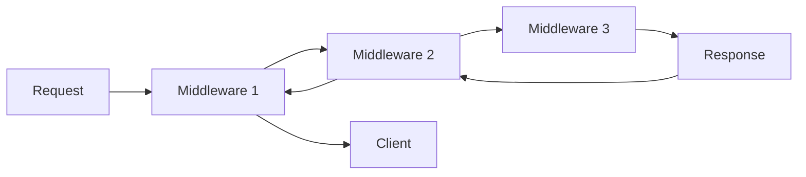

# Building Custom Middleware in ASP.NET Core: A Comprehensive Guide

 

## Table of Contents
- [Introduction](#introduction)
- [Understanding Middleware Basics](#understanding-middleware-basics)
- [Implementation Methods](#implementation-methods)
- [Best Practices](#best-practices)
- [Advanced Scenarios](#advanced-scenarios)

 

## Introduction

ASP.NET Core middleware components are software pieces that form a pipeline to handle requests and responses. This guide explores three distinct approaches to building custom middleware, each with its own use cases and benefits.

## Understanding Middleware Basics

Before diving into implementation methods, let's understand the fundamental concepts:



## Implementation Methods

### 1. Request Delegates Approach

The simplest way to create middleware using inline delegates:

```csharp
public class Program
{
    public static void Main(string[] args)
    {
        var builder = WebApplication.CreateBuilder(args);
        var app = builder.Build();

        // Basic middleware
        app.Use(async (context, next) =>
        {
            var timer = Stopwatch.StartNew();
            
            await next(context);
            
            timer.Stop();
            var elapsed = timer.ElapsedMilliseconds;
            
            context.Response.Headers.Add("X-Response-Time", elapsed.ToString());
        });

        // Conditional middleware
        app.Use(async (context, next) =>
        {
            if (context.Request.Query.ContainsKey("api-version"))
            {
                context.Request.Headers.Add("api-version", 
                    context.Request.Query["api-version"].ToString());
            }
            
            await next(context);
        });

        app.Run();
    }
}
```

#### Key Features
- Quick to implement
- Ideal for simple scenarios
- Access to both request and response
- Can be conditional
- No separate class required

### 2. Convention-Based Middleware

A more structured approach using a dedicated class:

```csharp
public class RequestLoggingMiddleware
{
    private readonly RequestDelegate _next;
    private readonly ILogger<RequestLoggingMiddleware> _logger;
    private readonly RequestLoggingOptions _options;

    public RequestLoggingMiddleware(
        RequestDelegate next,
        ILogger<RequestLoggingMiddleware> logger,
        IOptions<RequestLoggingOptions> options)
    {
        _next = next;
        _logger = logger;
        _options = options.Value;
    }

    public async Task InvokeAsync(HttpContext context)
    {
        // Pre-request logging
        var request = await FormatRequest(context.Request);
        _logger.LogInformation($"Incoming Request: {request}");

        // Continue the pipeline
        await _next(context);

        // Post-response logging
        var response = await FormatResponse(context.Response);
        _logger.LogInformation($"Outgoing Response: {response}");
    }

    private async Task<string> FormatRequest(HttpRequest request)
    {
        request.EnableBuffering();
        
        var body = await new StreamReader(request.Body)
            .ReadToEndAsync();
        
        request.Body.Position = 0;

        return $"{request.Method} {request.Path}{request.QueryString} {body}";
    }

    private async Task<string> FormatResponse(HttpResponse response)
    {
        response.Body.Seek(0, SeekOrigin.Begin);
        var text = await new StreamReader(response.Body).ReadToEndAsync();
        response.Body.Seek(0, SeekOrigin.Begin);

        return $"{response.StatusCode}: {text}";
    }
}

// Extension method for clean registration
public static class RequestLoggingMiddlewareExtensions
{
    public static IApplicationBuilder UseRequestLogging(
        this IApplicationBuilder builder)
    {
        return builder.UseMiddleware<RequestLoggingMiddleware>();
    }
}
```

#### Usage
```csharp
app.UseRequestLogging();
```

#### Key Features
- Organized code structure
- Reusable across applications
- Supports dependency injection
- Easy to test
- Configurable through options pattern

### 3. Factory-Based Middleware

The most flexible approach using the `IMiddleware` interface:

```csharp
public class PerformanceMiddleware : IMiddleware
{
    private readonly ILogger<PerformanceMiddleware> _logger;
    private readonly IMetricsService _metrics;

    public PerformanceMiddleware(
        ILogger<PerformanceMiddleware> logger,
        IMetricsService metrics)
    {
        _logger = logger;
        _metrics = metrics;
    }

    public async Task InvokeAsync(HttpContext context, RequestDelegate next)
    {
        var timer = Stopwatch.StartNew();
        var requestPath = context.Request.Path;

        try
        {
            await next(context);
            
            timer.Stop();
            
            await _metrics.RecordMetricAsync(new RequestMetric
            {
                Path = requestPath,
                Method = context.Request.Method,
                Duration = timer.ElapsedMilliseconds,
                StatusCode = context.Response.StatusCode
            });
        }
        catch (Exception ex)
        {
            _logger.LogError(ex, "Request failed for {Path}", requestPath);
            throw;
        }
    }
}

// Registration in Program.cs
services.AddTransient<PerformanceMiddleware>();
app.UseMiddleware<PerformanceMiddleware>();
```

#### Key Features
- Full dependency injection support
- Scoped instance per request
- Excellent for complex scenarios
- Better separation of concerns
- Easier unit testing

## Best Practices

### 1. Error Handling
```csharp
public async Task InvokeAsync(HttpContext context, RequestDelegate next)
{
    try
    {
        await next(context);
    }
    catch (Exception ex) when (LogError(ex))
    {
        throw; // Rethrow after logging
    }
}

private bool LogError(Exception ex)
{
    _logger.LogError(ex, "Unhandled exception");
    return false; // Continue with throw
}
```

### 2. Performance Considerations
- Use buffering judiciously
- Implement caching where appropriate
- Consider async/await overhead
- Monitor memory allocations

### 3. Configuration
```csharp
public class MiddlewareOptions
{
    public bool EnableLogging { get; set; }
    public string[] ExcludedPaths { get; set; }
    public int TimeoutSeconds { get; set; }
}

// In Program.cs
services.Configure<MiddlewareOptions>(configuration.GetSection("Middleware"));
```

## Advanced Scenarios

### 1. Conditional Middleware
```csharp
public async Task InvokeAsync(HttpContext context, RequestDelegate next)
{
    if (ShouldProcess(context))
    {
        await ProcessRequest(context);
    }
    
    await next(context);
}

private bool ShouldProcess(HttpContext context)
{
    return !_options.ExcludedPaths.Contains(context.Request.Path);
}
```

### 2. Chaining Multiple Middleware
```csharp
app.UseMiddleware<AuthenticationMiddleware>()
   .UseMiddleware<LoggingMiddleware>()
   .UseMiddleware<CompressionMiddleware>();
```

### 3. Branching Pipeline
```csharp
app.Map("/api", apiApp =>
{
    apiApp.UseMiddleware<ApiVersionMiddleware>();
    apiApp.UseMiddleware<ApiKeyMiddleware>();
});
```

## Middleware Implementation Comparison
```
| Approach | Complexity | DI Support | Ideal Use Cases | Key Benefits |
|---------|-----------|------------|----------------|-------------|
| Request Delegates | Low | Limited | Quick solutions, prototypes | Fast implementation, straightforward for simple scenarios |
| Convention-based | Medium | Good | Reusable components, shared middleware | Balance between simplicity and power, good for team collaboration |
| Factory-based | High | Excellent | Complex business logic, enterprise applications | Sophisticated DI, advanced features, better testability |
```
Choose your implementation approach based on your specific requirements, considering factors such as maintainability, reusability, and the overall complexity of your middleware needs.

 