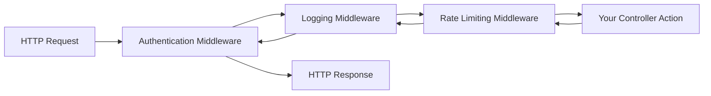

export const metadata = {
  title: '3 Ways to Build Custom Middleware in ASP.NET Core | Mohammed Mostafa',
  description: 'Middleware is software that is assembled into an app pipeline to handle requests and responses.',
  openGraph: {
    title: '3 Ways to Build Custom Middleware in ASP.NET Core',
    description: 'Middleware is software that is assembled into an app pipeline to handle requests and responses.',
    images: ['/og/3-ways-to-build-custom-middleware-in-aspnet-core.png'],
    type: 'article',
  },
  twitter: {
    card: 'summary_large_image',
    title: '3 Ways to Build Custom Middleware in ASP.NET Core',
    description: 'Middleware is software that is assembled into an app pipeline to handle requests and responses.',
    images: ['/og/3-ways-to-build-custom-middleware-in-aspnet-core.png'],
  },
}

# Building Custom Middleware in ASP.NET Core: A Comprehensive Guide

 

## Table of Contents
- [Introduction](#introduction)
- [Understanding Middleware Basics](#understanding-middleware-basics)
- [Implementation Methods](#implementation-methods)
- [Best Practices](#best-practices)
- [Advanced Scenarios](#advanced-scenarios)

 

## Introduction

Let's be honest—when I first started working with ASP.NET Core, the middleware pipeline felt like black magic. Requests would go in, responses would come out, and somehow everything just worked. But once I understood how to build custom middleware, it became one of my favorite features of the framework.

Think of middleware as a series of functions that sit between your web server and your application logic. Each piece can inspect, modify, or even short-circuit the request/response flow. I've used custom middleware for everything from performance monitoring to complex authentication schemes, and once you master these three approaches, you'll find yourself reaching for middleware solutions constantly.

What makes ASP.NET Core middleware so powerful isn't just what it can do—it's how cleanly it integrates into the request pipeline. Unlike older .NET Framework modules and handlers, middleware is lightweight, testable, and composable. I've seen teams replace dozens of HTTP modules with just a few well-designed middleware components.

## Understanding Middleware Basics

Here's the mental model that finally made middleware click for me: imagine the request pipeline as an onion. Each layer of middleware wraps around the next, and when a request comes in, it travels through each layer, hits the core (your controller), and then travels back out through the same layers in reverse.



### The Pipeline Reality

What's fascinating about this design is that each middleware component gets **two chances** to do work: once on the way in (before calling `next()`), and once on the way out (after calling `next()`). I've used this pattern to implement request timing, response compression, and error handling that feels almost magical to the consuming code.

Here's what actually happens when you chain middleware:

```csharp
// This is conceptually what happens inside the pipeline
async Task ProcessRequest(HttpContext context)
{
    // Middleware 1 - Before
    await LoggingMiddleware(context, async () => {
        // Middleware 2 - Before  
        await AuthenticationMiddleware(context, async () => {
            // Middleware 3 - Before
            await YourController(context);
            // Middleware 3 - After
        });
        // Middleware 2 - After
    });
    // Middleware 1 - After
}
```

## Implementation Methods

### 1. Request Delegates Approach: Quick and Dirty (But Powerful)

This is where I started when I needed to add functionality fast. Request delegates are perfect for simple, focused middleware that doesn't need dependency injection or complex configuration. I use this approach for prototyping or when I need something lightweight.

```csharp
public class Program
{
    public static void Main(string[] args)
    {
        var builder = WebApplication.CreateBuilder(args);
        var app = builder.Build();

        // Performance timing middleware - this saved my bacon during a production issue
        app.Use(async (context, next) =>
        {
            var timer = Stopwatch.StartNew();
            var logger = context.RequestServices.GetService<ILogger<Program>>();
            
            // Before: Log the incoming request
            logger?.LogInformation("Processing {Method} {Path}", 
                context.Request.Method, context.Request.Path);
            
            await next(context);
            
            // After: Log the response time
            timer.Stop();
            var elapsed = timer.ElapsedMilliseconds;
            
            context.Response.Headers.Add("X-Response-Time", elapsed.ToString());
            logger?.LogInformation("Completed {Method} {Path} in {ElapsedMs}ms", 
                context.Request.Method, context.Request.Path, elapsed);
                
            // Alert on slow requests - this caught a memory leak once
            if (elapsed > 5000)
            {
                logger?.LogWarning("SLOW REQUEST: {Method} {Path} took {ElapsedMs}ms", 
                    context.Request.Method, context.Request.Path, elapsed);
            }
        });

        // API versioning middleware - handles backward compatibility gracefully
        app.Use(async (context, next) =>
        {
            // Set default version if not specified
            if (!context.Request.Headers.ContainsKey("API-Version") && 
                !context.Request.Query.ContainsKey("api-version"))
            {
                context.Request.Headers.Add("API-Version", "1.0");
            }
            
            // Extract version for downstream middleware
            var version = context.Request.Headers["API-Version"].FirstOrDefault() ??
                         context.Request.Query["api-version"].FirstOrDefault() ?? "1.0";
                         
            context.Items["API-Version"] = version;
            
            await next(context);
            {
                context.Request.Headers.Add("api-version", 
                    context.Request.Query["api-version"].ToString());
            }
            
            await next(context);
        });

        app.Run();
    }
}
```

#### Key Features
- Quick to implement
- Ideal for simple scenarios
- Access to both request and response
- Can be conditional
- No separate class required

### 2. Convention-Based Middleware

A more structured approach using a dedicated class:

```csharp
public class RequestLoggingMiddleware
{
    private readonly RequestDelegate _next;
    private readonly ILogger<RequestLoggingMiddleware> _logger;
    private readonly RequestLoggingOptions _options;

    public RequestLoggingMiddleware(
        RequestDelegate next,
        ILogger<RequestLoggingMiddleware> logger,
        IOptions<RequestLoggingOptions> options)
    {
        _next = next;
        _logger = logger;
        _options = options.Value;
    }

    public async Task InvokeAsync(HttpContext context)
    {
        // Pre-request logging
        var request = await FormatRequest(context.Request);
        _logger.LogInformation($"Incoming Request: {request}");

        // Continue the pipeline
        await _next(context);

        // Post-response logging
        var response = await FormatResponse(context.Response);
        _logger.LogInformation($"Outgoing Response: {response}");
    }

    private async Task<string> FormatRequest(HttpRequest request)
    {
        request.EnableBuffering();
        
        var body = await new StreamReader(request.Body)
            .ReadToEndAsync();
        
        request.Body.Position = 0;

        return $"{request.Method} {request.Path}{request.QueryString} {body}";
    }

    private async Task<string> FormatResponse(HttpResponse response)
    {
        response.Body.Seek(0, SeekOrigin.Begin);
        var text = await new StreamReader(response.Body).ReadToEndAsync();
        response.Body.Seek(0, SeekOrigin.Begin);

        return $"{response.StatusCode}: {text}";
    }
}

// Extension method for clean registration
public static class RequestLoggingMiddlewareExtensions
{
    public static IApplicationBuilder UseRequestLogging(
        this IApplicationBuilder builder)
    {
        return builder.UseMiddleware<RequestLoggingMiddleware>();
    }
}
```

#### Usage
```csharp
app.UseRequestLogging();
```

#### Key Features
- Organized code structure
- Reusable across applications
- Supports dependency injection
- Easy to test
- Configurable through options pattern

### 3. Factory-Based Middleware

The most flexible approach using the `IMiddleware` interface:

```csharp
public class PerformanceMiddleware : IMiddleware
{
    private readonly ILogger<PerformanceMiddleware> _logger;
    private readonly IMetricsService _metrics;

    public PerformanceMiddleware(
        ILogger<PerformanceMiddleware> logger,
        IMetricsService metrics)
    {
        _logger = logger;
        _metrics = metrics;
    }

    public async Task InvokeAsync(HttpContext context, RequestDelegate next)
    {
        var timer = Stopwatch.StartNew();
        var requestPath = context.Request.Path;

        try
        {
            await next(context);
            
            timer.Stop();
            
            await _metrics.RecordMetricAsync(new RequestMetric
            {
                Path = requestPath,
                Method = context.Request.Method,
                Duration = timer.ElapsedMilliseconds,
                StatusCode = context.Response.StatusCode
            });
        }
        catch (Exception ex)
        {
            _logger.LogError(ex, "Request failed for {Path}", requestPath);
            throw;
        }
    }
}

// Registration in Program.cs
services.AddTransient<PerformanceMiddleware>();
app.UseMiddleware<PerformanceMiddleware>();
```

#### Key Features
- Full dependency injection support
- Scoped instance per request
- Excellent for complex scenarios
- Better separation of concerns
- Easier unit testing

## Best Practices

### 1. Error Handling
```csharp
public async Task InvokeAsync(HttpContext context, RequestDelegate next)
{
    try
    {
        await next(context);
    }
    catch (Exception ex) when (LogError(ex))
    {
        throw; // Rethrow after logging
    }
}

private bool LogError(Exception ex)
{
    _logger.LogError(ex, "Unhandled exception");
    return false; // Continue with throw
}
```

### 2. Performance Considerations
- Use buffering judiciously
- Implement caching where appropriate
- Consider async/await overhead
- Monitor memory allocations

### 3. Configuration
```csharp
public class MiddlewareOptions
{
    public bool EnableLogging { get; set; }
    public string[] ExcludedPaths { get; set; }
    public int TimeoutSeconds { get; set; }
}

// In Program.cs
services.Configure<MiddlewareOptions>(configuration.GetSection("Middleware"));
```

## Advanced Scenarios

### 1. Conditional Middleware
```csharp
public async Task InvokeAsync(HttpContext context, RequestDelegate next)
{
    if (ShouldProcess(context))
    {
        await ProcessRequest(context);
    }
    
    await next(context);
}

private bool ShouldProcess(HttpContext context)
{
    return !_options.ExcludedPaths.Contains(context.Request.Path);
}
```

### 2. Chaining Multiple Middleware
```csharp
app.UseMiddleware<AuthenticationMiddleware>()
   .UseMiddleware<LoggingMiddleware>()
   .UseMiddleware<CompressionMiddleware>();
```

### 3. Branching Pipeline
```csharp
app.Map("/api", apiApp =>
{
    apiApp.UseMiddleware<ApiVersionMiddleware>();
    apiApp.UseMiddleware<ApiKeyMiddleware>();
});
```

## Middleware Implementation Comparison
```
| Approach | Complexity | DI Support | Ideal Use Cases | Key Benefits |
|---------|-----------|------------|----------------|-------------|
| Request Delegates | Low | Limited | Quick solutions, prototypes | Fast implementation, straightforward for simple scenarios |
| Convention-based | Medium | Good | Reusable components, shared middleware | Balance between simplicity and power, good for team collaboration |
| Factory-based | High | Excellent | Complex business logic, enterprise applications | Sophisticated DI, advanced features, better testability |
```
Choose your implementation approach based on your specific requirements, considering factors such as maintainability, reusability, and the overall complexity of your middleware needs.

 