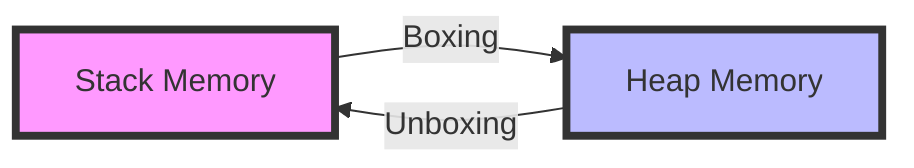
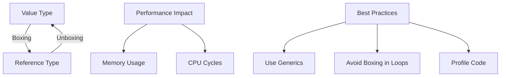

# Deep Dive into C# Boxing and Unboxing

 

## Table of Contents
- [Understanding the Fundamentals](#understanding-the-fundamentals)
- [Memory Management Deep Dive](#memory-management-deep-dive)
- [Practical Implementation](#practical-implementation)
- [Performance Optimization](#performance-optimization)
- [Best Practices](#best-practices)
- [Advanced Scenarios](#advanced-scenarios)

 

## Understanding the Fundamentals

In the world of C#, understanding boxing and unboxing is crucial for writing efficient code. These operations are fundamental to how C# handles type conversions between value types and reference types.

### What is Boxing?

Boxing is the process of wrapping a value type within a reference type. Think of it as putting a small value into a box that can be handled uniformly with other boxed values.

```csharp
// Boxing in action
int number = 42;                // Value type on the stack
object boxed = number;          // Boxed into a reference type on the heap
```

### What is Unboxing?

Unboxing is the reverse operation - extracting the value type from its boxed form. It's like taking the value out of the box.

```csharp
object boxed = 42;              // Boxed value
int unboxed = (int)boxed;       // Unboxing back to a value type
```

 

## Memory Management Deep Dive

### Stack vs Heap: Understanding Memory Allocation

Understanding where your data lives is crucial for performance optimization:



#### Stack Memory Characteristics
- Fast access
- Size-limited
- Automatic cleanup
- Value types live here

#### Heap Memory Characteristics
- Flexible size
- Garbage collected
- Reference types live here
- Boxed values reside here

 

## Practical Implementation

### Basic Boxing Operations

Let's explore various ways boxing occurs in C#:

```csharp
// Explicit boxing
int number = 42;
object boxedNumber = (object)number;

// Implicit boxing
IComparable comparable = number;

// Boxing through method calls
Console.WriteLine(number);  // Boxing occurs here!
```

### Working with Nullable Types

Nullable types provide a boxing-free way to handle null values:

```csharp
// No boxing occurs here
int? nullableNumber = 42;
nullableNumber = null;

// Safe operations
if (nullableNumber.HasValue)
{
    Console.WriteLine(nullableNumber.Value);
}
```

 

## Performance Optimization

### Measuring Boxing Impact

Here's a simple benchmark to demonstrate the performance impact:

```csharp
public class BoxingBenchmark
{
    public static void Measure()
    {
        const int iterations = 1_000_000;
        var stopwatch = new Stopwatch();

        // Without boxing
        stopwatch.Start();
        int sum = 0;
        for (int i = 0; i < iterations; i++)
        {
            sum += i;
        }
        stopwatch.Stop();
        Console.WriteLine($"No boxing: {stopwatch.ElapsedMilliseconds}ms");

        // With boxing
        stopwatch.Restart();
        object boxedSum = 0;
        for (int i = 0; i < iterations; i++)
        {
            boxedSum = (int)boxedSum + i;  // Boxing on each iteration
        }
        stopwatch.Stop();
        Console.WriteLine($"With boxing: {stopwatch.ElapsedMilliseconds}ms");
    }
}
```

### Memory Footprint

Memory Footprint
When examining the memory impact of boxing operations, it's important to understand the significant size differences between boxed and unboxed value types. For boolean values, while they only occupy 1 byte in their unboxed form, they require at least 24 bytes when boxed due to the overhead of the object header and type information. Integer types follow a similar pattern - a standard int uses 4 bytes unboxed but needs 24+ bytes when boxed. Long integers, which normally use 8 bytes, also expand to at least 24 bytes when boxed. The most dramatic difference occurs with decimal types, which grow from 16 bytes in their unboxed form to 40+ bytes when boxed. This substantial increase in memory usage highlights why avoiding unnecessary boxing operations is crucial for performance-sensitive applications.

 

## Best Practices

### Do's and Don'ts

#### Do's
- Use generic collections (`List<int>` instead of `ArrayList`)
- Implement `IEquatable<T>` for custom value types
- Use nullable value types when null is needed
- Profile your application for boxing hotspots

#### Don'ts
- Avoid boxing in tight loops
- Don't use non-generic collections for value types
- Avoid unnecessary interface implementations on structs
- Don't use `object` parameters when specific types can be used

### Optimizing Collections

```csharp
// Bad practice - causes boxing
ArrayList numbers = new ArrayList();
numbers.Add(42);  // Boxes the int

// Good practice - no boxing
List<int> numbers = new List<int>();
numbers.Add(42);  // No boxing occurs

// Best practice for performance-critical code
Span<int> numbers = stackalloc int[100];
```

 

## Advanced Scenarios

### Custom Value Types

Creating efficient custom value types:

```csharp
public readonly struct Money : IEquatable<Money>
{
    private readonly decimal amount;

    public Money(decimal amount) => this.amount = amount;

    // Implement IEquatable<T> to avoid boxing
    public bool Equals(Money other) => amount == other.amount;

    // Override object.Equals
    public override bool Equals(object obj) =>
        obj is Money other && Equals(other);

    // Always override GetHashCode with Equals
    public override int GetHashCode() => amount.GetHashCode();

    // Operator overloading for natural syntax
    public static Money operator +(Money a, Money b) =>
        new Money(a.amount + b.amount);
}
```

### Generic Constraints

Using constraints to prevent boxing:

```csharp
// This constraint ensures T is a value type
public class ValueTypeProcessor<T> where T : struct
{
    public T Process(T value)
    {
        // No boxing occurs here
        return value;
    }
}
```

 

## Final Thoughts

Boxing and unboxing are essential concepts in C# that can significantly impact your application's performance. By understanding these operations and following best practices, you can write more efficient and maintainable code.

### Quick Reference Card



Remember: Boxing is not inherently bad, but unnecessary boxing in performance-critical code should be avoided. Always profile your application to identify where boxing might be causing performance issues.

---